# Audio Ducking Macro

This is an example Cisco Collaboration Device macro which improved audio in workspaces with Voice Lift/Sound Reinforcement and Ceiling Microphones by 'ducking' the Ceiling Microphones Gain/Level when the Voice Lift microphone is being used.

This example macro monitors the VuMeter levels of an incoming mic and automatically ducks (sets a low Gain or Level) of other mics when the monitors mic is considered high. This is useful when you are using voice lift in a room and would like to duck any ceiling mics while a person using a voice lift mic is talking.

## Overview

Voice Lift/Sound Reinforcement is a solution which enables every participant in a space to hear an microphone holding active speaker by broadcasting their voice out an in room speaker system. This solution can sometimes create issues in collaboration spaces where the Collab Devices microphones are mounted in the ceiling along side the Voice Lift audio system as the Ceiling Microphones may pick up the voice lift audio and well as the active speakers direct microphone signal. 


### Project Overview

```mermaid
---
config:
  layout: fixed
---
flowchart TB
    A("Person talks into microphone<br>🧑💬🎙️〰️〰️〰️") --> B["Audio goes to DSP"]
    B --> C1["Audio to Ceiling Speakers<br>🔊🔊🔊🔊🔊🔊🔊🔊🔊"] & C2["Audio to Cisco Collab Device<br>💬 〰️〰️〰️"]
    C1 --> D["Ceiling Speakers broadcast voice in room as voice lift<br>💬 〰️〰️〰️"]
    D --x E["Cisco Collab Device microphone captures voice lift sound<br>💬🎙️〰️〰️〰️"]
    C2 --> n2["💬 Single Audio Signal"]
    n2@{ shape: rounded}
    style n2 fill:transparent,stroke:#00C853
    linkStyle 4 stroke:#D50000,fill:none

```




This macro monitors the incoming microphone audio signal and lowers the gain of the ceiling microphones gain to prevent that audio from being captured and so therefore only the microphone audio source is sent into the call.

### Flow Diagram


## Setup

### Prerequisites & Dependencies: 

- Cisco Collaboration Device running RoomOS 11.x
- Seperate Microphone Line Inputs
- Web admin access to the device to upload the macro.


### Installation Steps:

1. Download the ``audio-ducking.js`` file and upload it to your Webex Room devices Macro editor via the web interface.
2. Configure the Macro by changing the initial values, there are comments explaining each one.
      ```javascript
      const config = {
       button: {                     // Customise the macros control button name, color and icon
         name: 'Audio Modes',        // Button and Panel name
         color: '#f58142',           // Button Color
         icon: 'Sliders'             // Button Icon
       },
       modeNames: {                  // Customise the macros mode names
         autoDuck: 'Auto Adjust Audience',
         presentersOnly: 'Presenters Only',
         presentersAndAudience: 'Presenters & Audience'
       },
       defaultMode: 'autoDuck',      // Specify the default mode
       mics: [                       // Specify which mics should be monitors
         { ConnectorType: 'Microphone', ConnectorId: 1 }   // { ConnectorType: 'Microphone' | 'Ethernet' | 'USBMicrophone'}
       ],
       duck: [                       // Specify which mics should be ducked or unducked
         { ConnectorType: 'Ethernet', ConnectorId: 1, SubId: 1 },
         { ConnectorType: 'Ethernet', ConnectorId: 2, SubId: 1 },
         { ConnectorType: 'Ethernet', ConnectorId: 3, SubId: 1 },
         { ConnectorType: 'Ethernet', ConnectorId: 4, SubId: 1 },
         { ConnectorType: 'Ethernet', ConnectorId: 5, SubId: 1 },
         { ConnectorType: 'Ethernet', ConnectorId: 6, SubId: 1 }
       ],
       threshold: {                  // Specify the thresholds in which the monitors mic is considered high or low
         high: 30,
         low: 25
       },
       levels: {                     // Specify the Gain/Levels which should be set when ducked or unducked
         duck: 0,
         unduck: 30
       },
       unduck:{
         timeout: 2                  // Specify the duration where the monitored mics are low before unducking
       },
       samples: 4,                   // The number of samples taken every 100ms, 4 samples at 100ms = 400ms
       panelId: 'audioDucking'
     }
      ```
3. Enable the Macro on the editor.
    
    
    
## Demo

*For more demos & PoCs like this, check out our [Webex Labs site](https://collabtoolbox.cisco.com/webex-labs).


## License

All contents are licensed under the MIT license. Please see [license](LICENSE) for details.


## Disclaimer
<!-- Keep the following here -->  
 Everything included is for demo and Proof of Concept purposes only. Use of the site is solely at your own risk. This site may contain links to third party content, which we do not warrant, endorse, or assume liability for. These demos are for Cisco Webex use cases, but are not Official Cisco Webex Branded demos.


## Questions
Please contact the WXSD team at [wxsd@external.cisco.com](mailto:wxsd@external.cisco.com?subject=audio-ducking-macro) for questions. Or, if you're a Cisco internal employee, reach out to us on the Webex App via our bot (globalexpert@webex.bot). In the "Engagement Type" field, choose the "API/SDK Proof of Concept Integration Development" option to make sure you reach our team. 
